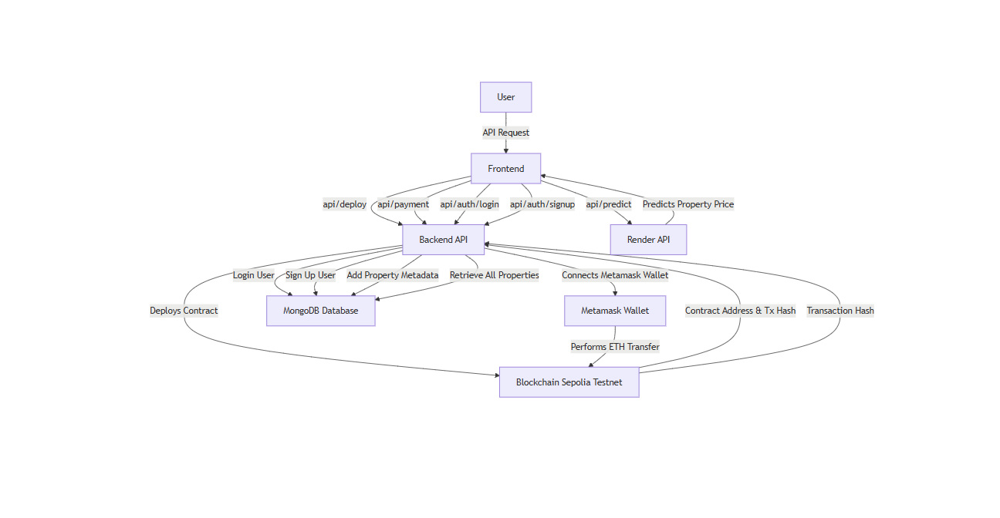

# Real Estate Tokenization

## Overview

This backend system revolutionizes real estate tokenization by integrating blockchain technology, user authentication, property metadata management, and predictive analytics. Designed for seamless interaction with the frontend, it ensures efficient contract deployment, ETH transfers, property price prediction, and user authentication.

---

## System Workflow

### Complete Data Flow

1. **Frontend Interaction**

   - The user initiates requests (e.g., deploy contract, make payments, log in, or view property data) through the **frontend interface**.
   - These requests are sent to the backend API.

2. **Backend API Processing**

   - **Deploy Contract (`/api/deploy`)**:
     - A request triggers the deployment of a smart contract to the **Sepolia Testnet**.
     - The backend interacts with the blockchain, returning the **contract address** and **transaction hash**.
   - **ETH Payment (`/api/payment`)**:
     - Directs the user to connect their **Metamask wallet**.
     - Executes ETH transfers on the blockchain and provides a **transaction hash** upon success.
   - **User Authentication**:
     - Login (`/api/auth/login`) and signup (`/api/auth/signup`) routes manage user accounts in the **MongoDB database**.
   - **Property Metadata**:
     - Add Property Metadata: Stores listed property details in the database.
     - Display All Properties: Fetches metadata for all properties from the database.
   - **Property Price Prediction (`/api/predict`)**:
     - Calls an external **Render API** for price prediction using property attributes.

3. **Blockchain Interaction**

   - Contracts and payments are securely processed via the **Sepolia Testnet**, ensuring transparent and immutable transactions.

4. **Database Operations**

   - User details and property metadata are stored and retrieved using **MongoDB** for persistent and reliable data management.

5. **External API Integration**
   - The **Render-hosted API** predicts property prices based on data provided by the backend, enhancing decision-making.

---

## Flowchart

The following flowchart provides a visual representation of the system's workflow:



---

## Key Features

1. **Blockchain-Powered Transactions**:

   - Secure smart contract deployments and ETH payments using the Sepolia Testnet.

2. **User Authentication**:

   - Robust login and signup features powered by MongoDB.

3. **Property Management**:

   - Add and view property metadata for streamlined real estate management.

4. **AI-Powered Insights**:
   - Integrates predictive analytics via an external API to estimate property prices.

---

## Setup Instructions

### Prerequisites

Ensure you have the following installed:

- Node.js
- MongoDB
- Vite
- Express
- Metamask (browser extension)

### Steps

1. Clone the repository:
   ```bash
   git clone <repository-url>
   cd <repository-folder>
   ```
2. Run the following commands:

   ```bash
   npm i

   ```

3. Update the .env files

   ```bash
   MONGO_URI= your mongodb url
   JWT_SECRET= your_jwt_secret_key

   ALCHEMY_API_URL= your alchemy api url
   PRIVATE_KEY= your metamask private key
   ```
